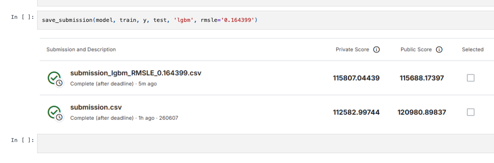
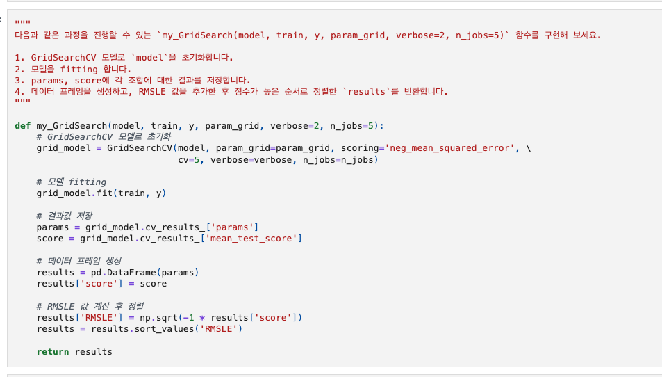
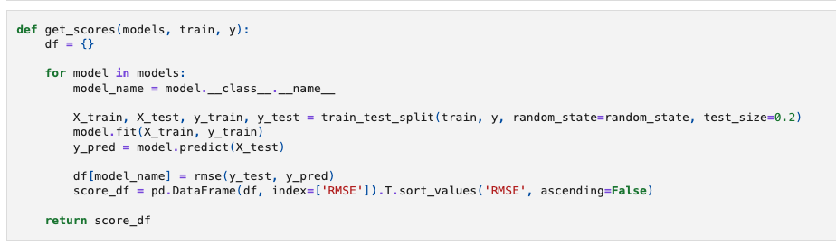
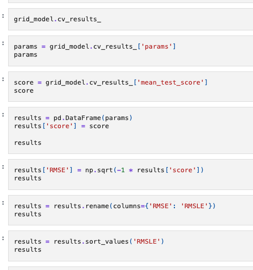
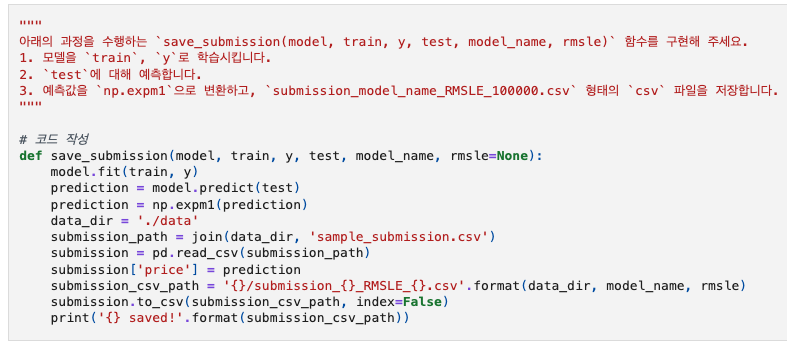
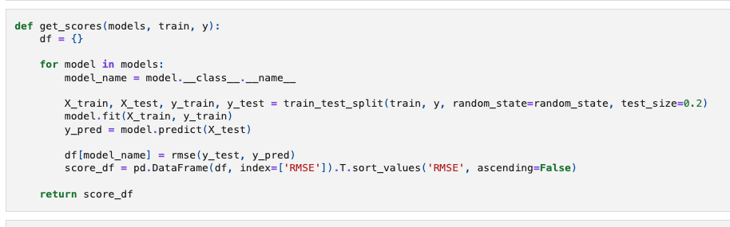

# AIFFEL Campus Online Code Peer Review Templete
- 코더 : 조연우
- 리뷰어 : 김민욱


# PRT(Peer Review Template)
- [x]  **1. 주어진 문제를 해결하는 완성된 코드가 제출되었나요?**
    - 데이터 불러오기(셀 6)부터 타겟 로그변환, 모델 학습/비교, GridSearch 튜닝, 제출 파일 저장까지 한 흐름이 끊김 없이 완성되어 있습니다.  
    - 같은 폴더에 submission.csv 결과물이 있고, 노트북 마지막에 캐글 제출 결과 스크린샷까지 붙여두셔서 끝까지 제출하신 게 한눈에 보였습니다.  
          
    - 다만 노트북의 셀 실행 결과(output)가 대부분 비어 있어서, 중간 결과 표(모델별 RMSE, GridSearch 결과 등)는 직접 보지 못하고 코드와 마지막 제출 스크린샷으로만 확인했습니다. 셀을 한 번 실행해서 출력까지 저장해두시면 결과를 바로 보여줄 수 있어 더 좋을 것 같습니다.  

- [x]  **2. 전체 코드에서 가장 핵심적이거나 가장 복잡하고 이해하기 어려운 부분에 작성된 주석 또는 doc string을 보고 해당 코드가 잘 이해되었나요?**
    - 가장 핵심적인 부분은 `my_GridSearch` 함수라고 생각합니다. GridSearch 결과(`cv_results_`)에서 params와 score를 꺼내 데이터프레임으로 만들고, neg_mean_squared_error 점수를 RMSLE로 바꿔(`np.sqrt(-1 * score)`) 정렬해 돌려주는 흐름이라 처음엔 좀 헷갈렸는데, 함수 위에 1~4단계로 무엇을 하는지 docstring을 적어두셔서 코드를 위에서 아래로 읽으니 바로 이해됐습니다.  
          
    - 함수 안에도 "모델 초기화 -> fitting -> 결과값 저장 -> 데이터 프레임 생성 -> RMSLE 계산 후 정렬"처럼 단계마다 한국어 주석이 달려 있어서, 함수가 길어도 어느 부분이 무슨 역할을 하는지 따라가기 편했습니다.  

- [x]  **3. 에러가 난 부분을 디버깅하여 문제를 해결한 기록을 남겼거나 새로운 시도 또는 추가 실험을 수행해봤나요?**
    - get_scores 함수에서 GradientBoosting, XGBoost, LightGBM, RandomForest 네 모델을 한꺼번에 돌려 RMSE로 비교한 뒤, 그 결과를 보고 LightGBM으로 GridSearch를 진행하신 흐름이 좋았습니다. 한 모델만 제출한 게 아니라 비교해보고 골랐다는 게 잘 드러납니다.  
           
    - 그 밑에서 GridSearch 결과를 단계별로(params -> score -> 데이터프레임 -> RMSLE 추가 -> 정렬) 직접 펼쳐 확인한 뒤, 그 과정을 그 밑의 my_GridSearch 함수로 묶으신 것도 "손으로 확인하고 나서 일반화한" 흐름이라 자연스러웠습니다.  
          

- [ ]  **4. 회고를 잘 작성했나요?**
    - 노트북 마지막에 캐글 제출 결과 스크린샷은 있는데, 글로 적은 회고(배운 점/아쉬운 점/느낀 점)나 전체 실행 플로우 그래프는 확인하지 못했습니다.  
    - 코드 흐름은 깔끔하니까, "타겟에 로그변환을 왜 했는지, 모델 비교에서 무엇을 느꼈는지" 두세 줄만 마크다운으로 덧붙이면 문서의 완성도가 한층 올라갈 것 같습니다.  

- [x]  **5. 코드가 간결하고 효율적인가요?**
    - 위 에서 손으로 돌리던 모델 비교 로직을 `get_scores` 함수로 묶고, GridSearch도 `my_GridSearch`로, 제출도 `save_submission`으로 함수화하셔서 중복이 잘 정리돼 있었습니다.  
          
    - 변수명과 들여쓰기도 PEP8에서 크게 벗어난 곳 없이 읽기 편했습니다.  
    - 다만 `get_scores`에서 `score_df` 를 만드는 줄이 for 루프 안에 들어가 있어 모델마다 한 번씩 다시 만들어집니다. 결과는 같지만 루프 밖으로 한 번만 빼주면 더 깔끔합니다 (아래 회고 참고).  
          


# 회고(참고 링크 및 코드 개선)
```
[좋은 점]
- 데이터 로드부터 제출까지 흐름이 끊기지 않아서 따라 읽기 편했습니다.  
- 모델 4개를 비교한 뒤 LightGBM으로 GridSearch까지 가는 과정이 깔끔했고,  
  get_scores / my_GridSearch / save_submission 함수화도 잘 돼 있어 배울 점이 많았습니다.  
  
[개선 제안 — get_scores 의 score_df 생성 위치]  
현재 코드:  
  
    def get_scores(models, train, y):
        df = {}
        for model in models:
            model_name = model.__class__.__name__
            X_train, X_test, y_train, y_test = train_test_split(train, y, random_state=random_state, test_size=0.2)
            model.fit(X_train, y_train)
            y_pred = model.predict(X_test)
            df[model_name] = rmse(y_test, y_pred)
            score_df = pd.DataFrame(df, index=['RMSE']).T.sort_values('RMSE', ascending=False)  # 루프 안
        return score_df

제안 코드 (score_df 생성을 루프 밖으로):

    def get_scores(models, train, y):
        df = {}
        for model in models:
            model_name = model.__class__.__name__
            X_train, X_test, y_train, y_test = train_test_split(train, y, random_state=random_state, test_size=0.2)
            model.fit(X_train, y_train)
            y_pred = model.predict(X_test)
            df[model_name] = rmse(y_test, y_pred)
        score_df = pd.DataFrame(df, index=['RMSE']).T.sort_values('RMSE', ascending=False)  # 루프 밖에서 한 번만
        return score_df

- 모델별 점수를 df 에 다 모은 뒤 마지막에 한 번만 표를 만들면 되는 구조라,
  루프 안에서 매번 score_df 를 다시 만들 필요가 없습니다.
- 로직과 결과는 그대로이고 표를 만드는 위치만 옮긴 것이라 안전한 정리입니다.

수고 많으셨습니다!
```
